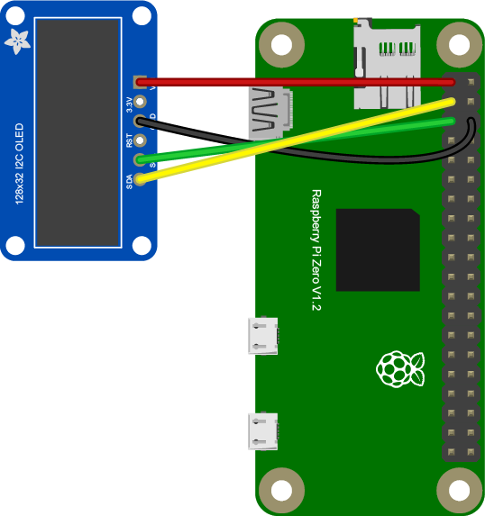

# SSD1306 OLED Screen Examples

The SSD1306 is a handy little (very little) OLED screen for microcontrollers and embedded systems. It has both an SPI and an I2C interface, so it's possible to interface it with a Pi, Arduino, or whatever controller you're using. There are several libraries for this screen in the Node Package Manager respository, and one of the most popular, as of this writing, is  [oled-i2c-bus](https://www.npmjs.com/package/oled-i2c-bus). Its main dependency is the [i2c-bus](https://www.npmjs.com/package/i2c-bus) library.

## The Circuit

To connect the screen to the Pi, just connect the SDA and SCL lines to the Pi's SDA and SCL connections along with  power and ground.  On the Pi header, the 3.3V connection is on the top left; ground is third from the top on the right; SDA is second from the top on the left; and SCL is third from the top on the left. The pin connections of your particular SSD1306 screen will depend on where you buy it.

## The Code

The library provides many [examples](https://www.npmjs.com/package/oled-i2c-bus#i2c-screens) in its documentation, and they're a good place to get started. Here's an [example that runs a clock on the screen](https://github.com/tigoe/PiRecipes/tree/master/SSD1306Display).