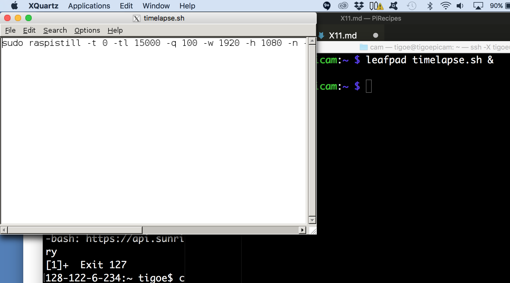

# GUI Apps through the CLI

__Note: these notes are out of date and may not work, as of 15 Apr 2022__ TODO: update these.

Sometimes you want to be able to use a GUI application on the Pi, even though you're logged in through the terminal. You can do this in many cases using X11, the [X Window System](http://www.x.org/). X11 sends the information for drawing an application's graphic interface (its window) from your Pi to your personal computer so your personal computer can draw the window and allow you to interact with the application through it. 

For example, let's say you want a text editor in its own window. There's a basic one for Pi called leafpad. Here's what you need to do :

Install an X11 client on your computer. [XQuartz](https://www.xquartz.org/) works on MacOS, and [Windows Subsystem for Linux (WSL)](https://docs.microsoft.com/en-us/windows/wsl/install) or  [Cygwin](https://www.cygwin.com/) should work on Windows. 

On your Pi, launch `raspi-config` and choose the `Interfacing Options` menu item. In the submenu, chose `VNC` to enable the VNC server. Then reboot your Pi.

Now login to your Pi like so:

````
$ ssh -X username@pi.address
````

Replace username and pi.address with your username and Pi's address. the -X will cause the login to use X11, and on MacOS will launch XQuartz in the background. 

Once you're logged into the Pi, you need do enable a few things:

First, copy your .Xauthority file to the root directory so you can use X11 through sudo:

````
sudo cp ~/.Xauthority ~root/
````

Next change the DISPLAY environment variable so that X11 sends the windows to your personal computer:

````
export DISPLAY="127.0.0.1:10.0"
````

That's all you need to enable X11. Now install leafpad like so:

````
$ sudo apt-get update
$ sudo apt-get install leafpad
````

Then launch it:

````
leafpad &
````

When you launch windowed applications, you may want to use the & which frees up the command line immediately afterward. That way you can use the command line as well as the windows. 

Figure 1 below shows Leafpad running through XQuartz on my mac, launched from my Pi (terminal window in background):



_Figure 1. Leafpad running through XQuartz via X11_

If you plan to use X11 a lot, you might want to add the configuration lines, copied again below, to your .bashrc file, so they run every time you login. .bashrc is an invisible file in your home directory that holds your login preferences. You can edit it with a text editor like so:  

````
sudo nano ~/.bashrc
````
 (or `sudo leafpad ~/bashrc`, if you prefer)

 Then at the bottom add:

 ````
 sudo cp ~/.Xauthority ~root/
 export DISPLAY="127.0.0.1:10.0"
 ````

 Then save the file, quit the editor, and log in again. Adding the first of these lines will force you to type in your password on login twice. I find it's a helpful reminder that I'm using X11, but you may prefer otherwise. 


For more on the topic, here's the [Raspberry Pi foundation's intro to VNC](https://www.raspberrypi.org/documentation/remote-access/vnc/README.md). They assume that you've installed the full [Raspbian with Desktop distribution](https://www.raspberrypi.org/downloads/raspbian/), however, so you may want to make a separate disk image with that if you want to follow their guide.


