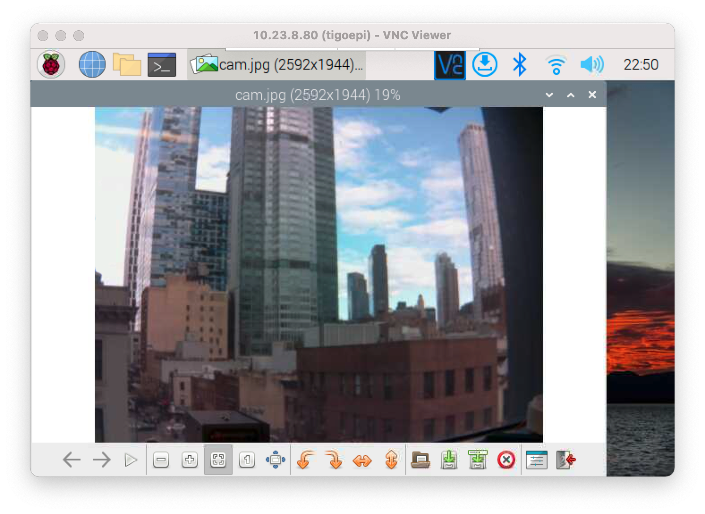

# GUI Apps through the CLI

Sometimes you want to be able to use a GUI application on the Pi, even though you're logged in through the terminal. You can do this in many cases using Virtual Network Connection, or VNC on the Pi. It essentially means you get the desktop of the Pi through the network.

In order to do this, you need to be running a desktop version of the Pi's Raspbian operating system, not the Lite version. Once that's the case, on your Pi, launch `raspi-config` and choose the `Interfacing Options` menu item. In the submenu, chose `VNC` to enable the VNC server. In the `Display Options` menu, set the `VNC Resolution` to a value that works for you. The smaller the resolution, the faster the refresh, but the less you can see. 1024x768 works reasonably well on a local network. 

If you are running a firewall, check that port 5900 is open to incoming connections as well. Then reboot your Pi.It will restart with a VNC server running.

On your personal computer, you'll need a VNC viewer. The [VNC Viewer](https://www.realvnc.com/en/connect/download/viewer/) from RealVNC works well. Download the version for your OS and install it. 

When you've got The Pi and VNC Viewer running, open VNC Viewer and connect ot the Pi's IP address. You will get asked for your username and password to log in. Once you're logged in, the Pi's desktop will appear and you can operate it as a normal (though probably slow) desktop environment. 

This can be particularly useful when you need to see a camera attached ot the Pi. As a quick example, you can take a picture from an attached camera using raspistill like so:

````
$ raspistill -o cam.jpg
````

Then you can open Image Viewer through VNC to see the image, as seen in Figure 1:



_Figure 1. Raspberry Pi desktop as seen through VNC Viewer. The Image Viewer application is running (Applications Menu -> Graphics -> Image Viewer)_

For more on the topic, here's the [Raspberry Pi foundation's intro to VNC](https://www.raspberrypi.com/documentation/computers/remote-access.html). They assume that you've installed the full [Raspbian with Desktop distribution](https://www.raspberrypi.org/downloads/raspbian/), however, so you may want to make a separate disk image with that if you want to follow their guide.


