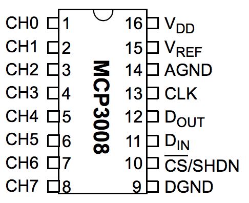
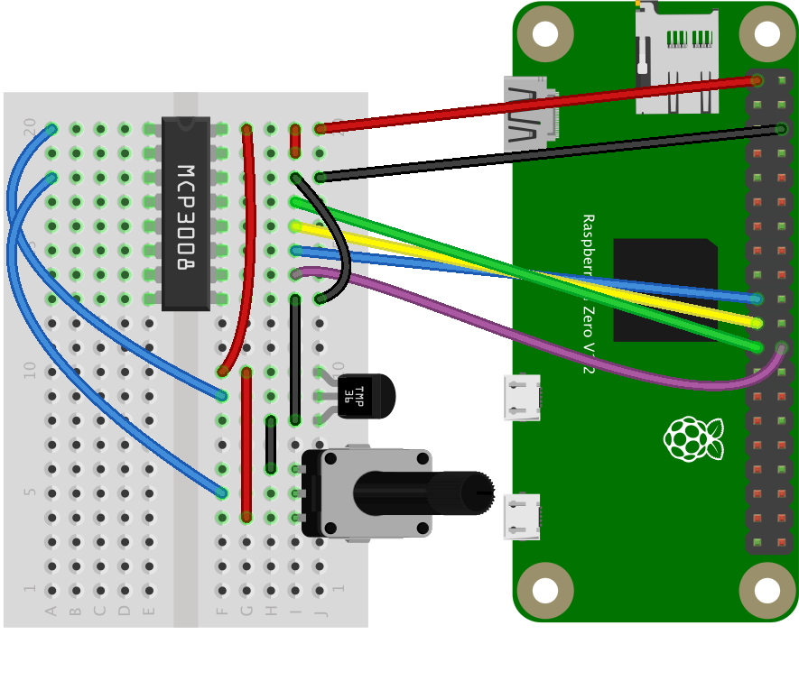

# MCP3008 Analog-to-Digital Converter

The MCP3008 is an inexpensive analog-to-digital converter that has an SPI interface. Each channel has 10-bit resolution, so it's a perfect ADC for use with the Pi or a BeagleBone or other embedded board. 

## MCP3008 Pin Functions

The pin diagram is shown in Figure 1 below. Counting pins in a u-pattern from top left to bottom left, then across to bottom right and up to top right, the pins are as follows: 

* pins 1 through 8 are the ADC channels 0 through 7
* Pin 9 - digital ground
* Pin 10 - chip select
* Pin 11 - Data in (MOSI)
* Pin 12 - Data out (MISO)
* Pin 13 - Data clock (CLK)
* Pin 14 - analog ground
* Pin 15 - Voltage reference
* Pin 16 - Voltage supply




_Figure 1. MCP3008 pin diagram_

The [MCP3008 datasheet](https://datasheet.octopart.com/MCP3008-I/P-Microchip-datasheet-8326659.pdf) has more information if you need it. 

## The Circuit

The SPI lines are connected to each other in a standard fashion: the Pi's MOSI pin (pin 10 on the left, counting down from the SD card slot) connects to the MCP3008's Data in (MOSI) pin (pin 11). The Pi's MISO pin (pin 11 on the right) connects to the MCP3008's data out (MISO) pin, pin 12. The clocks on both boards are connected; that's pin 12 on the right for the Pi, and pin 13 for the MCP3008. The Pi's CE0 pin (pin 12 on the right) is connected to the MCP3008's chip select, pin 10. Finally, the MCP3008's grounds all connect to ground on the Pi (pin 3 on the right) and Voltage in connects to the Pi's 3.3V out (pin 1 on the left).

Images made in Fritzing and Illustrator CS.




_Figure 2. MCP3008 connected to a Raspberry Pi Zero_

For this example, a TMP36 temperature sensor is connected to the MCP3008's input 0 (pin 1) and a potentiometer is connected to the MCP3008's input 2 (pin 3). The front of the TMP36 is the flat side. The center pins of both the TMP36 and the potentiometer are the pins connected to the MCP3008's inputs. The left pin of both is attached to ground, and the right pin of both is attached to 3.3V.  

This example uses the [mcp-spi-adc node.js library](https://github.com/fivdi/mcp-spi-adc). 

## Enabliing SPI and Installing the Library

You'll also need to enable the Pi's SPI interface. To do this, launch raspi-config using sudo like so:

````
$ sudo raspi-config
````
When the menu appears, choose option 5, Interfacing Options, then option P4, SPI. Once enabled, you can exit raspi-config by choosing Finish. 
To install it, make a new project directory, then type the following on the command line of your Pi to install the library:

````
$ npm install mcp-spi-adc
````

Alternatively, if you clone this repository, you'll get the whole directory, and can install mcp-spi-adc using the package.json file like so:

````
$ npm install
````

## Running the Script

Once you have the library installed, you're ready to go. See the index.js file in this repo for detailed notes. Note that you will have to run this script using sudo on the Pi, in order to get control of the SPI lines. So, to test the script, type:

````
$ sudo node index.js
````
And you should get some sensor readings.

The [temp-humidity-client.js](temp-humidity-client.js) example shows how to read a temperature and a humidity sensor and how to send the data using an HTTPS request to a server.

