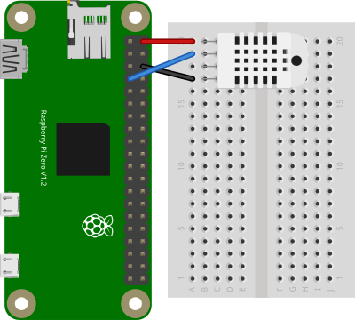

# Reading a DHTxx Temperature and Humidity Sensor 

# Rotary Encoder Input using GPIO 

This example shows how to read a DHT11 or DHT22 temperature and humidity sensor. These sensors use the OneWire interface, and are very common in microcontroller projects. The example uses  the [node.js node-dht-sensor library](https://www.npmjs.com/package/node-dht-sensor). This example was tested on a Raspberry Pi Zero.

## The Code
The code can be found [in this repository](https://github.com/tigoe/PiRecipes/tree/master/node-dht-sensor).

## The Circuit

Pin 1 of the DHT sensor (on the left if you are holding the sensor facing you) is connected to the Pi's 5V power connection (top right pin if you are holding the Pi so that the GPIO pins are facing to the right). Pin 2 of the sensor connects to the Pi's GPIO4 (fourth down on the left side). Pin 3 is unconnected, and pin 4 is connected to the Pi's ground (third down from the top on the right). Figure 1 shows the configuration.



_Figure 1. DHT sensor to Raspberry Pi's GPIO pins._

## Installing the Library

Type the following on the command line of your Pi to install the library:

````sh
$ npm install node-dht-sensor
````

Alternatively, if you clone this repository, you'll get the whole directory, and can install the library using the package.json file like so:

````sh
$ npm install
````

## Running the Script

Once you have the library installed, you're ready to go. See the `basic-read.js` file in this repo for detailed notes. Note that you will have to run this script using sudo on the Pi. So, to test the script, type:

````sh
$ sudo node basic-read.js
````
And you should get some encoder readings, a JSON object with temperature and humidity.