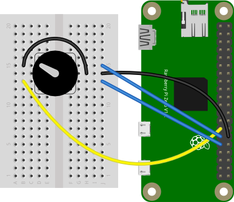
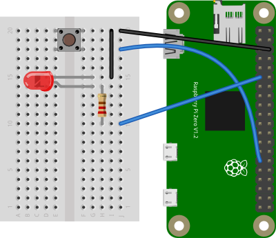

# GPIO Components Library 

The GPIO Components library wraps many of the things that the onoff library can do into useful components, like an encoder, a pushbutton, LEDs, and a seven-segment LED display. It is a useful replacement for the now-obsolete onoff-rotary library.

This example shows how to read a rotary encoder  attached to two digital inputs. It also shows how to read a pushbutton, and how to toggle an LED. It uses  the [node.js gpio-components library](https://www.npmjs.com/package/gpio-components). This example was tested on a Raspberry Pi Zero.

## The Code
There are four examples included here: 
* [Rotary Encoder](https://github.com/tigoe/PiRecipes/tree/master/gpio-components/encoder.js)
* [Rotary Encoder and Pushbutton](https://github.com/tigoe/PiRecipes/tree/master/gpio-components/encoder-pushbutton.js)
* [Pushbutton](https://github.com/tigoe/PiRecipes/tree/master/gpio-components/pushbutton.js)
* [Pushbutton and LED](https://github.com/tigoe/PiRecipes/tree/master/gpio-components/pushbutton-led.js)

## The Circuits

There are two circuits shown below: the rotary encoder circuit, and the pushbutton and LED circuit. 

### Rotary Encoder

For the rotary encoder, the center terminal is attached to the Pi Zero's ground pin (fifteenth pin down from the SD card holder on the right). The two outer terminals of the encoder are attached to GPIO pins 5 and 6 (pins 15 and 16 down from the SD card on the right). The encoder's pushbutton is connected to GPIO pin 0 (pin 14 down from the SD card on the right). The circuit is shown in Figure 1 below.

This configuration works for the pushbutton because pins 5 and 6 are configured with a pullup resistor on the Pi by default; likewise with the pushbutton. To see the default states of the GPIO pins, see Table 6-31 on pages 102 and 103 of the [BCM2835 ARM Peripherals datasheet](http://www.farnell.com/datasheets/1521578.pdf). The onoff library, on which this library depends, has [more detail on pullups and pulldowns](https://www.npmjs.com/package/onoff#configuring-pullup-and-pulldown-resistors) in its documentation.



_Figure 1. Rotary encoder connected to Raspberry Pi's GPIO pins. The encoder connects to GPIO 5 and 6 and ground._

### Pushbutton and LED
In the circuit for the LED and pushbutton examples, one terminal of a pushbutton is attached to the Pi Zero's pin 5 (fourteenth pin down from the SD card slot on the left side). The other terminal of the pushbutton is attached to the Pi's ground pin (third pin down on the right). One terminal of a 220-ohm resistor is attached to pin 17 (sixth pin down on the left side). An LED's anode is attached to the other terminal of the resistor. The LED's cathode is attached to ground on the Pi (third pin down on the right, or to the pushbutton's ground pin). The circuit is shown in Figure 2 below.

This configuration works for the pushbutton because pin 5 is configured with a pullup resistor on the Pi by default. To see the default states of the GPIO pins, see Table 6-31 on pages 102 and 103 of the [BCM2835 ARM Peripherals datasheet](http://www.farnell.com/datasheets/1521578.pdf). The onoff library documentation has [more detail on pullups and pulldowns](https://www.npmjs.com/package/onoff#configuring-pullup-and-pulldown-resistors).



_Figure 2. Pushbutton, LED, and resistor connected to Raspberry Pi's GPIO pins. The pushbutton connects to GPIO 5 and the LED to GPIO 17._

## Installing the Library

Type the following on the command line of your Pi to install the library:

````sh
$ npm install gpio-components
````

Alternatively, if you clone this repository, you'll get the whole directory, and can install the library using the `package.json` file like so:

````sh
$ npm install
````

## Running the Scripts

Once you have the library installed, you're ready to go. See the files in this repo for detailed notes. To test each script, type:

````sh
$ node scriptname.js
````
Replace `scriptname.js` with the name of each script: `encoder.js`, `encoder-pushbutton.js`, `pushbutton.js`, or `button-led.js`. 

### Encoder
When you run this script, you should get some encoder readings: `increment` for one direction, and `decrement` for the other, depending on how you wired the pins.  

### Encoder-Pushbutton
When you run this script, you should get some encoder readings: `increment` for one direction, and `decrement` for the other, depending on how you wired the pins. When you push the button, you should get `pressed` and `released` messages. 

### Pushbutton
When you run this script and you push the button, you should get `pressed` and `released` messages. 

### Button-LED
When you run this script and you push the button, you should get `pressed` and `released` messages, and the LED should toggle on and off with each press. 
