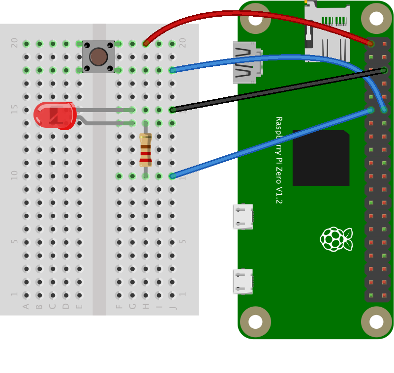

# GPIO Input

This example shows how to read digital inputs and control digital outputs on an embedded board using the [node.js onoff library](https://www.npmjs.com/package/onoff). This example was tested on a Raspberry Pi Zero.

## The Circuit

One terminal of a pushbutton is attached to the Pi Zero's pin 18 (sixth pin down from the SD card slot on the right side). The other terminal of the pushbutton is attached to the Pi's 3.3V pin (first pin down on the left). One terminal of a 220-ohm resistor is attached to pin 17 (sixth pin down on the left side). An LED's anode is attached to the other terminal of the resistor. The LED's cathode is attached to ground on the Pi (third pin down on the right). The circuit is shown in Figure 1 below.

This configuration works for the pushbutton because pin 18 is configured with a pulldown resistor on the Pi by default. To see the default states of the GPIO pins, see Table 6-31 on pages 102 and 103 of the [BCM2835 ARM Peripherals datasheet](http://www.farnell.com/datasheets/1521578.pdf). The onoff library documentation has [more detail on pullups and pulldowns](https://www.npmjs.com/package/onoff#configuring-pullup-and-pulldown-resistors).




_Figure 1. Pushbutton, LED, and resistor connected to Raspberry Pi's GPIO pins. The pushbutton connects to GPIO 18 and the LED to GPIO 17._

## Installing the Library

Type the following on the command line of your Pi to install the library:

````
$ npm install onoff
````

Alternatively, if you clone this repository, you'll get the whole directory, and can install mcp-spi-adc using the package.json file like so:

````
$ npm install
````

## Running the Script

Once you have the library installed, you're ready to go. See the index.js file in this repo for detailed notes. Note that you will have to run this script using sudo on the Pi. So, to test the script, type:

````
$ sudo node index.js
````
And you should get some pushbutton readings, and the LED should go on and off.
