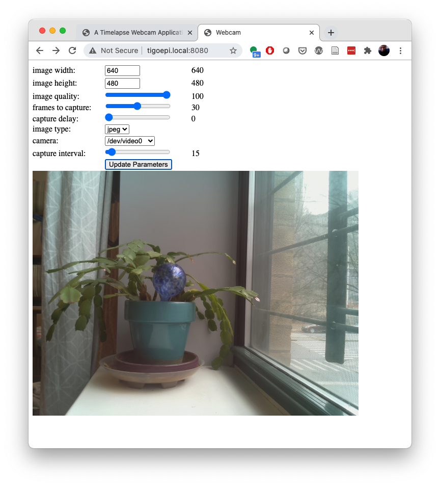

# A Timelapse Webcam Application

This application uses node.js and [fswebcam](https://www.raspberrypi.org/documentation/usage/webcams/) to create a timelapse cam. You can use it with a Pi camera, or with a USB webcam. Here is the [man page for fswebcam](https://manpages.ubuntu.com/manpages/bionic/man1/fswebcam.1.html). 



_Figure 1. Screenshot of the timelapse webcam interface, showing the controls for setting fswebcam parameters at the top, and the camera image below._

## The Client Interface

The client interface shows the latest image and a series of input controls to change the fswebcam settings. Clicking the Update Parameters button updates the server's fswebcam settings. The client starts by getting the fswebcam parameters from the server and the list of cameras and populates its input elements with that information. Then it starts an interval which regularly fetches the latest image. 

The interface is shown in Figure 1 above.


## The Code
The code can be found [in this repository](https://github.com/tigoe/PiRecipes/tree/master/timelapse-cam). Copy all the files of the timelapse-cam directory onto your Pi. Make sure to copy the empty `img` directory too, or fswebcam will produce an error when it tries to save the first image. 

## Installation
To run this app, you'll need to install the following components on your Pi:
* [node.js and npm](https://nodejs.org) - the server side JS tools. The latest version doesn't run on the Pi Zero, so I use the instructions from [this repo](https://github.com/sdesalas/node-pi-zero), which has distributions optimized for the Pi Zero.
* [pm2](https://pm2.keymetrics.io/) - I use this to turn the server script into a daemon, keep logs, etc. 
* [fswebcam](https://manpages.ubuntu.com/manpages/bionic/man1/fswebcam.1.html) - the cam software. 

The command line installs are as follows:

````sh
$ sudo apt update
$ wget -O - https://raw.githubusercontent.com/sdesalas/node-pi-zero/master/install-node-v11.5.0.sh | bash
$ sudo apt install pm2
$ sudo apt install fswebcam
````
For more on installing node.js, see [this link](https://itp.nyu.edu/networks/setting-up-a-raspberry-pi/#Upgrading_nodejs).

Once you have downloaded the git repository for the app onto your Pi, don't forget to `node install` to bring in the required libraries. 

## The Software Components
The components are as follows:

* server.js - the node.js script that runs as the server
  * [express.js](https://expressjs.com/) - the library for making the server
  * [node-webcam](https://www.npmjs.com/package/node-webcam) - the library for controlling fswebcam
* public html directory including:
  * index.html - the HTML interface
  * script.js - the client-side JavaScript
  * styles.css - the client-side CSS file
  * img directory - the directory of images
* [fswebcam](https://www.raspberrypi.org/documentation/usage/webcams/) - the webcam software taking the pictures

## The Server API
The node.js server initializes fswebcam and takes a picture once on a regular interval. The images are saved in the `img` subdirectory of the `public` directory with the following filename format: `imageyyyy-mm-dd_hh:mm:ss.jpg` (or .png if you change the file format).

The server runs on port 8080.

The server has the following HTTP endpoints:

* GET `/latest` - returns the path to the latest image. 
* GET `/cameras` - returns a list of the cameras available to fswebcam, from the `/dev` directory. 
* POST `/params` - sets the parameters of fswebcam and the intervam between image captures. Expects a JSON body with the available parameters of fswebcam, and an additional interval parameter. Returns the fswebcam parameters and interval.
* GET `/params` - returns the fswebcam parameters and interval. 

To run the server from the command line, type either

````sh
$ node server.js 
````
or if you want to run it in the background, 

````sh
$ pm2 start server.js
````
